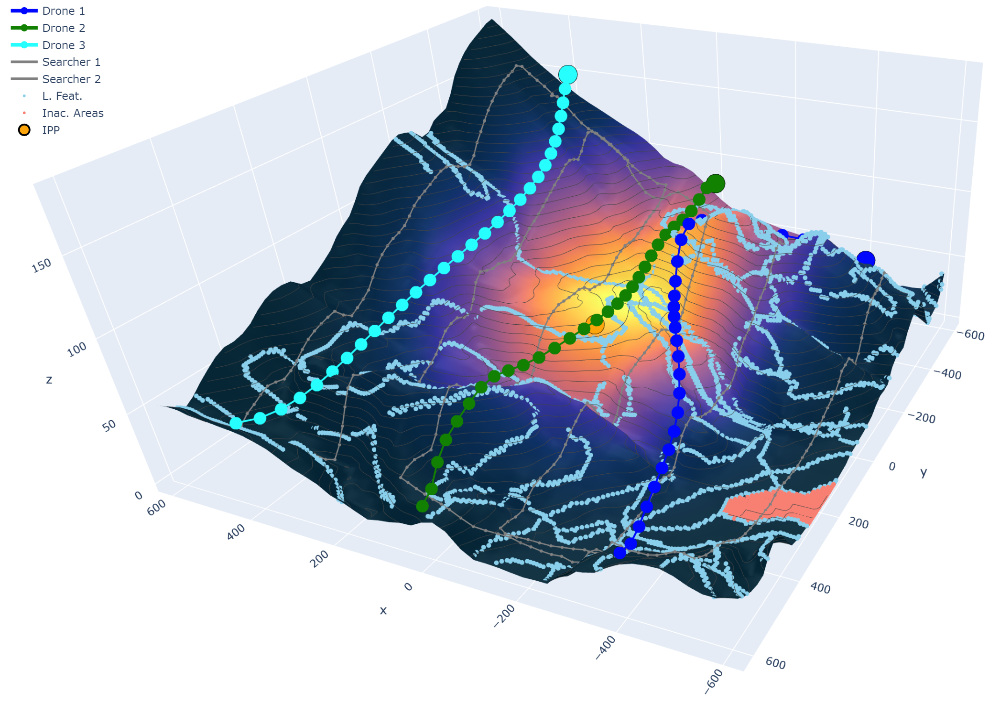
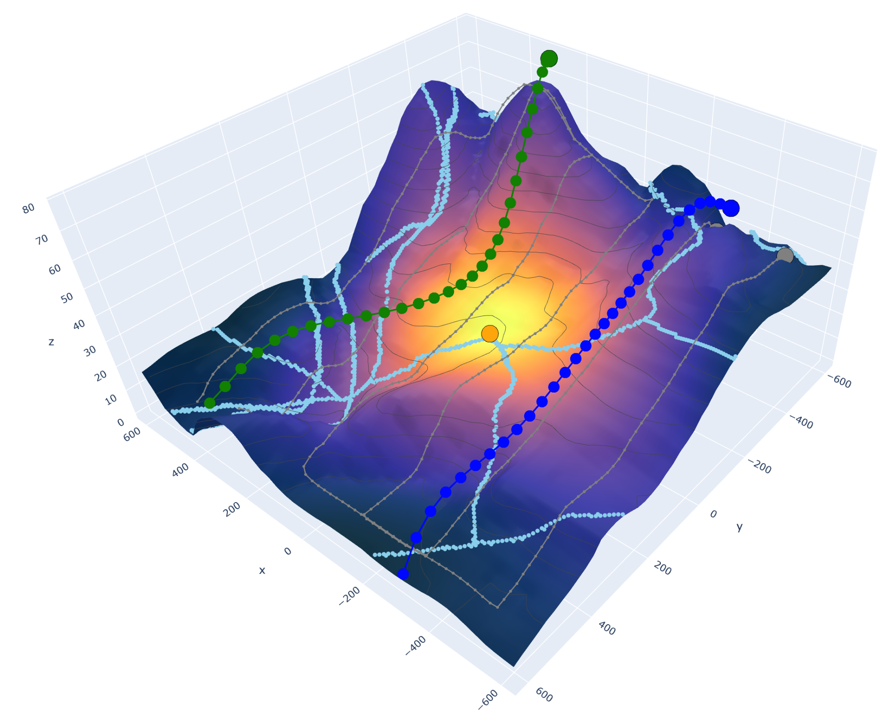

# planning_llh_bgc

## Basic Run

To plan a set of paths for a team of robots, run `test_robotgp.py` in the main directory.

In the main method of that script, there is a set of parameters being defined (look in `mrmh/params.py` for more details on the parameter fields)

During execution, several pieces of information will be displayed on the console, starting with status updates then ending with training iteration statistics. 
When the last training iteration is complete the instance will be plotted in a 3D interactive plot within a browser tab.

## Figures

Results from test_robotgp.py with plotting params:

* Example at HMPark location: 

* Example at Kentland location: 

